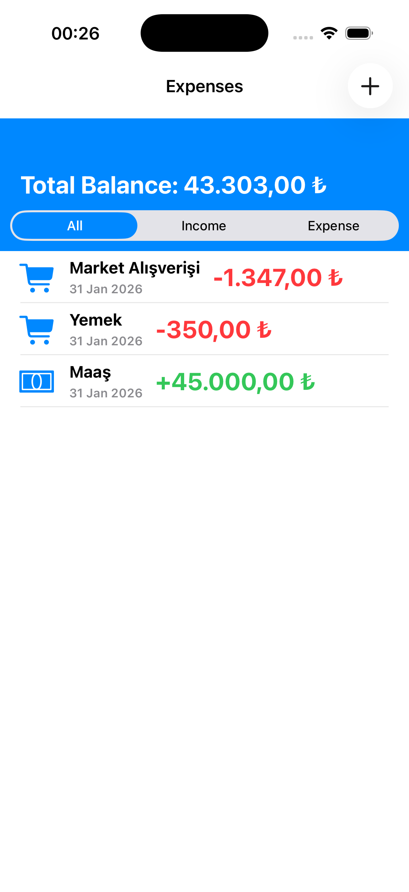
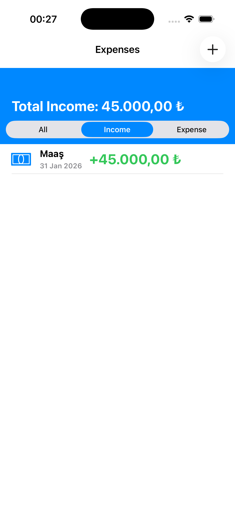
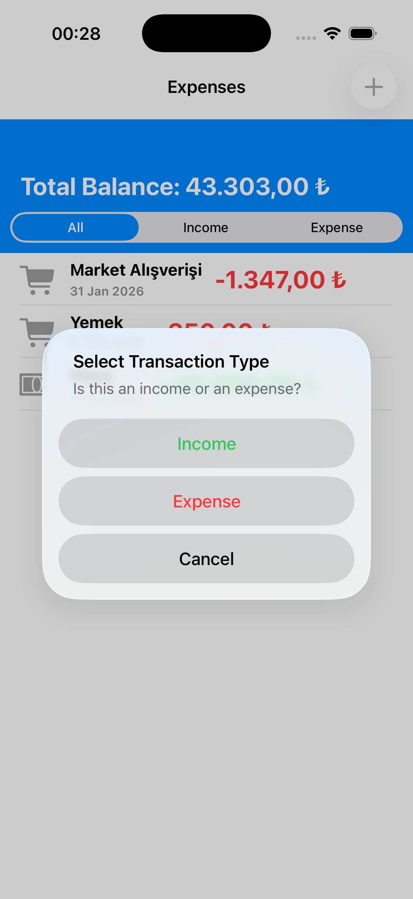

# 💸 CashFlow - Personal Finance Tracker

[🇹🇷 Türkçe](#-türkçe) | [🇬🇧 English](#-english)

---

## 🇹🇷 Türkçe

**CashFlow**, harcamalarınızı ve gelirlerinizi kontrol altına almanızı sağlayan, modern iOS teknolojileriyle geliştirilmiş şık bir finans takip uygulamasıdır. Karmaşık Excel tabloları yerine, basit ve güçlü bir arayüz sunar.

### 🚀 Özellikler

* **Gelir/Gider Ayrımı:** İşlemlerinizi türüne göre (Income/Expense) kaydedin ve renk kodlarıyla (Yeşil/Kırmızı) anında ayırt edin.
* **Akıllı Filtreleme:** Tek dokunuşla sadece gelirlerinizi, giderlerinizi veya tüm bakiyenizi görüntüleyin.
* **Dinamik Başlık:** Seçilen filtreye göre (Örn: "Toplam Gelir") başlık ve hesaplama anlık olarak güncellenir.
* **Modern Arayüz:** Storyboard kullanılmadan, tamamen kod ile (Programmatic UI) tasarlanmış akıcı kullanıcı deneyimi.
* **Güvenli Veri:** Tüm verileriniz **SwiftData** teknolojisi ile cihazınızda güvenle saklanır.
* **Akıllı Klavye:** Ondalık sayı girişi ve otomatik para birimi formatlama (₺/$) desteği.

### 🛠 Teknik Detaylar (Teknoloji Yığını)

Bu proje, **Junior iOS Developer** yetkinliklerini sergilemek amacıyla, en güncel Apple teknolojileri kullanılarak geliştirilmiştir.

* **Dil:** Swift 5
* **Framework:** UIKit (Programmatic - No Storyboard)
* **Mimari:** MVVM (Model-View-ViewModel)
* **Veritabanı:** SwiftData
* **Versiyon Kontrol:** Git & GitHub

**Öne Çıkan Kod Yapıları:**
* `UIStackView` ve `AutoLayout` ile responsive tasarım.
* `UISegmentedControl` ile veri filtreleme mantığı.
* ViewModel üzerinden yönetilen Business Logic (İş Mantığı).
* Reusable (Tekrar kullanılabilir) `Extension` ve `Custom Cell` yapıları.

### 📦 Kurulum

1.  Projeyi klonlayın: `git clone https://github.com/KULLANICI_ADIN/CashFlow-App.git`
2.  `CashFlow.xcodeproj` dosyasını Xcode ile açın.
3.  Simülatörü seçin ve `Cmd + R` ile çalıştırın.

---

## 🇬🇧 English

**CashFlow** is a sleek personal finance tracker app built with modern iOS technologies, designed to help you keep track of your income and expenses effortlessly.

### 🚀 Features

* **Income & Expense Tracking:** Log transactions by type and visualize them with color-coded indicators (Green/Red).
* **Smart Filtering:** Filter your transaction list by Income, Expense, or All with a single tap using Segmented Control.
* **Dynamic Balance:** The header title and total balance update dynamically based on the selected filter.
* **Modern UI:** Developed entirely with **Programmatic UI** (No Storyboards) for a smooth user experience.
* **Data Persistence:** Secured local data storage using Apple's latest **SwiftData** framework.
* **Smart Input:** Supports decimal input and locale-aware currency formatting.

### 🛠 Tech Stack

This project demonstrates **Junior iOS Developer** competencies using the latest industry standards.

* **Language:** Swift 5
* **UI Framework:** UIKit (Programmatic)
* **Architecture:** MVVM (Model-View-ViewModel)
* **Database:** SwiftData
* **Version Control:** Git & GitHub

**Key Implementation Details:**
* Responsive layout using `UIStackView` and `AutoLayout`.
* Data filtering logic with `UISegmentedControl`.
* Separation of concerns using the MVVM pattern.
* Reusable code with custom Extensions and TableView Cells.

### 📦 Installation

1.  Clone the repo: `git clone https://github.com/YOUR_USERNAME/CashFlow-App.git`
2.  Open `CashFlow.xcodeproj` in Xcode.
3.  Select a simulator and press `Cmd + R` to run.

---

### 📸 Screenshots / Ekran Görüntüleri

| Main Screen | Income Filter | Expense Filter | Add Transaction |
|:---:|:---:|:---:|:---:|
|  |  |  |  |

---
Developed by **[Emre ÇOBAN]**
